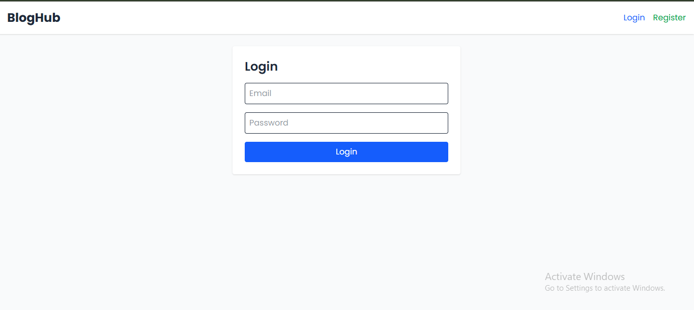
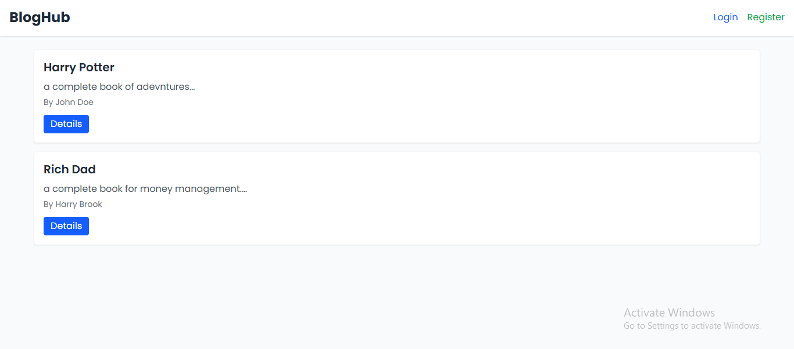
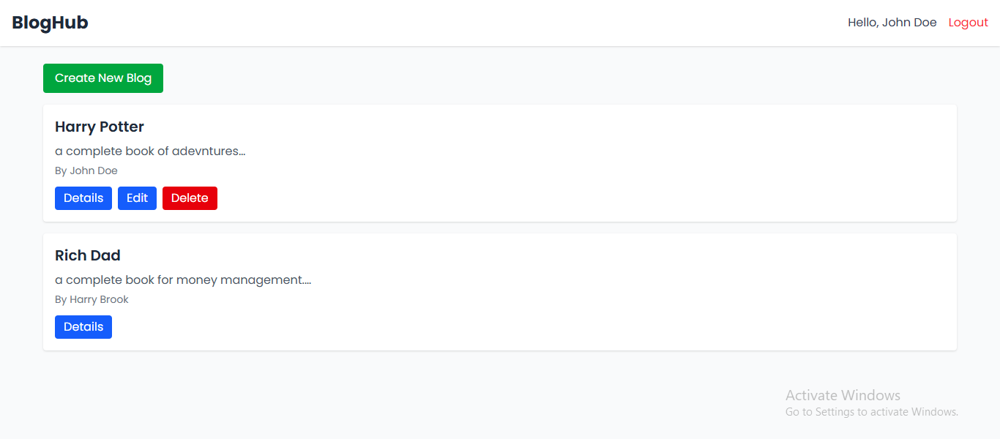
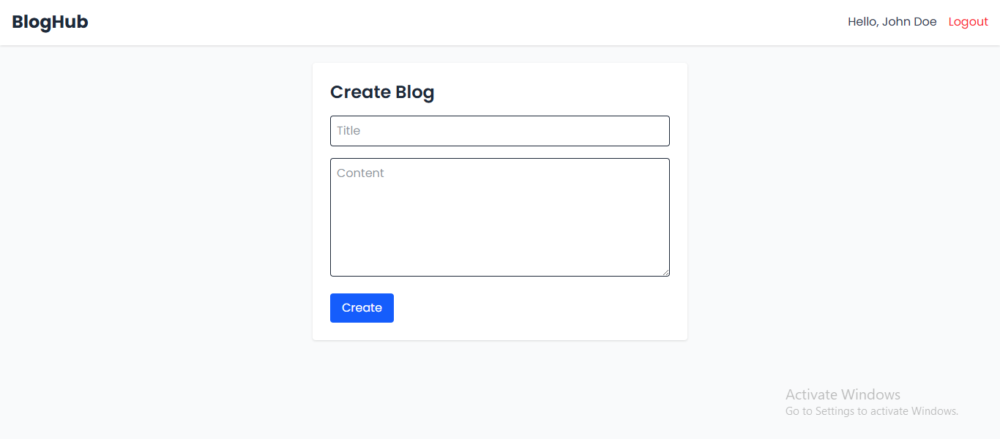
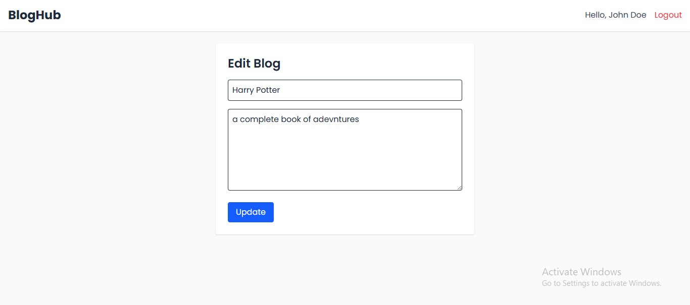

# 📝 BlogHub - Full Stack MERN Blogging Platform

BlogHub is a fully production-ready **MERN stack blogging application**. It allows users to register, log in, and create, read, update, and delete blog posts. The project is divided into:

- 🌐 **Client** — built using **React**, **Redux**, **Tailwind CSS**, and **Axios**
- 🛠️ **Server** — built using **Node.js**, **Express.js**, **MongoDB**, and **JWT authentication**

---

## 🖼️ Screenshots

Here are a few UI previews of the BlogHub application:

### 🔐 Login Page



### 🏠 Home Page with Blogs (before login)


### 🏠 Home Page with Blogs (after login)



### ✍️ Create Blog 



### ✍️ Edit Blog 



---

## 🔧 Technologies Used

### Server
- Node.js
- Express.js
- MongoDB with Mongoose
- JWT (JSON Web Token)
- bcrypt.js
- dotenv
- cors
- express-validator
- Repository Pattern
- Global Error Handling

### Client
- React.js
- Redux Toolkit
- React Router
- Tailwind CSS
- Axios
- Vite

---

## 🌟 Features

- ✅ User registration and login
- ✅ JWT-based authentication
- ✅ Create, edit, delete, and view blogs
- ✅ Only authors can update or delete their blogs
- ✅ Modern and responsive UI with Tailwind CSS
- ✅ Modular and maintainable code structure
- ✅ API error handling and alerts
- ✅ Secure local storage of token and user info

---

## Clone the Repository

```bash
git clone https://github.com/binayak597/bloghub.git
cd bloghub

---
```

## 🚀 Getting Started (Server)


### 1. Navigate to (Client and Server) Folder

```bash
cd server
cd client
```

Follow these steps to set up and run the backend locally:

### 2. Environment Variables

Create a `.env` file in the root directory with the following variables by using .env.example file as reference:
#### server
```env
PORT=your_port
MONGO_URI=your_mongodb_connection_string
JWT_SECRET=your_jwt_secret_key
CLIENT_URL=your_client_url
```

#### client

```env
VITE_BASE_URL=your_backend_url
```
### 3. Install Dependencies

```bash
npm install
```

### 4. 🔄 API Endpoints
#### ✅ Auth Routes

| Method | Route              | Description         |
| ------ | ------------------ | ------------------- |
| POST   | /api/auth/register | Register new user   |
| POST   | /api/auth/login    | Login existing user |

#### ✍️ Blog Routes

| Method | Route           | Description               |
| ------ | --------------- | ------------------------- |
| GET    | /api/blogs      | Get all blogs             |
| GET    | /api/blogs/\:id | Get a single blog         |
| POST   | /api/blogs      | Create a blog (protected) |
| PUT    | /api/blogs/\:id | Update blog (author only) |
| DELETE | /api/blogs/\:id | Delete blog (author only) |

### Run

#### client 
```bash
npm run dev
```
#### server
```bash
npm run start 
```

### 🚀 Deployment Platform for free(Optional)
#### (Backend Platform)

- Render

- Railway

#### (Frontend Platform)

- Vercel 

- Netlify

### Make sure to:

Update the .env with production variables

Set CORS origin properly

Enable deployment build scripts if needed


### 🙋‍♂️ Contributing
We welcome contributions! Please follow these steps:

Fork the repo

Create a new branch (feature/your-feature-name)

Commit your changes

Push and create a PR

### 🧠 Author

**Made with ❤️ by Binayak Mukherjee**

- [🔗 LinkedIn](https://www.linkedin.com/in/binayak-mukherjee/)
- [💻 GitHub](https://github.com/binayak597)

---


